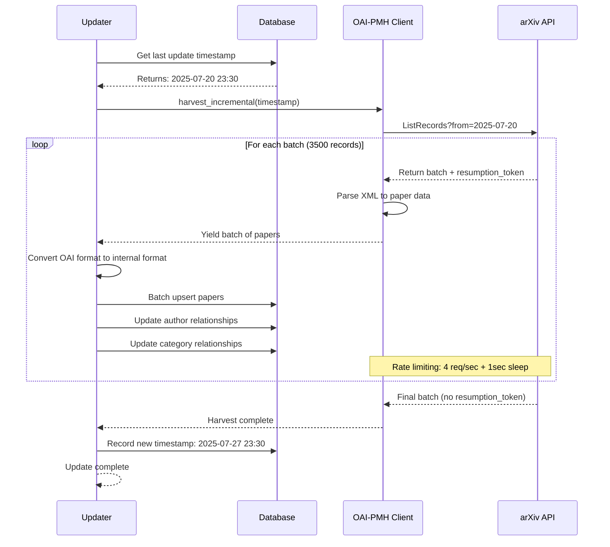
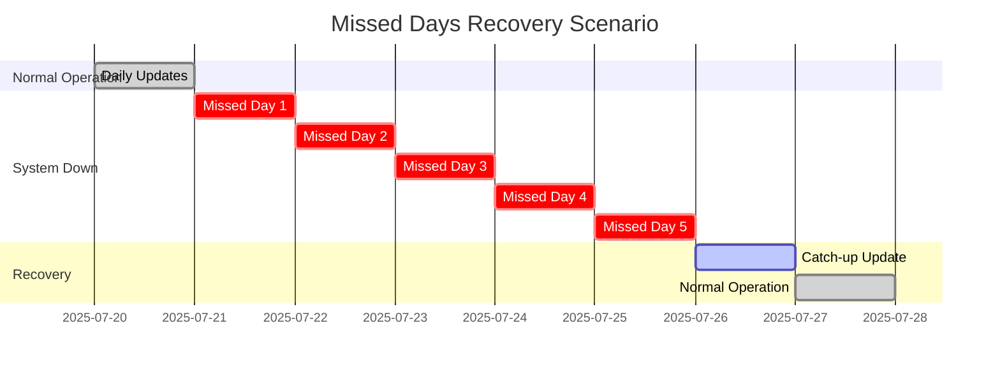
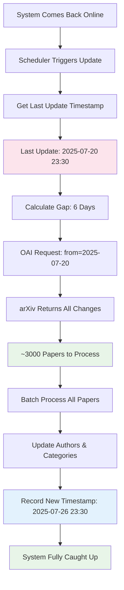
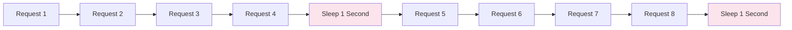
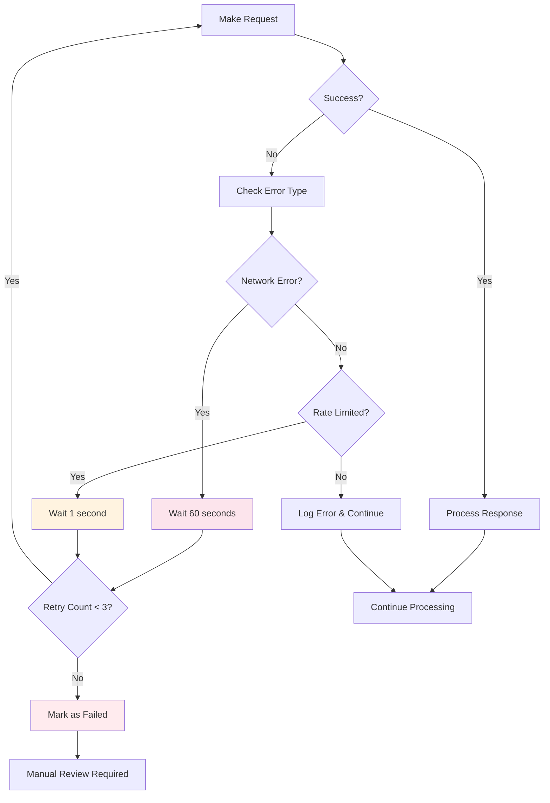
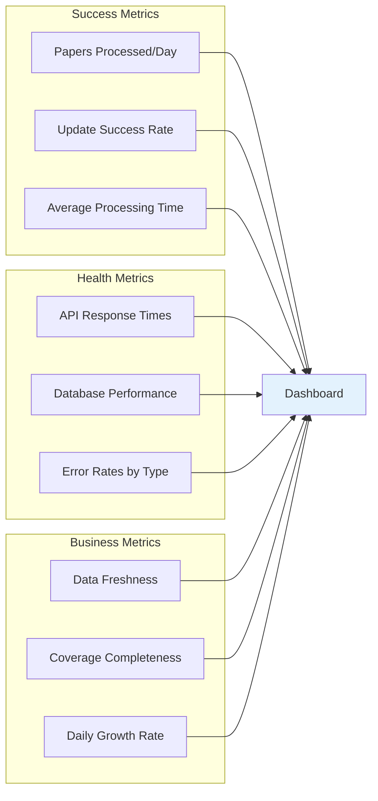

# PaperWeave Incremental Update System

This document explains in detail how PaperWeave's incremental update system works, including timestamp detection, OAI-PMH harvesting, and automatic recovery from missed updates.

## Overview

PaperWeave uses a **timestamp-driven incremental update system** that leverages arXiv's OAI-PMH protocol to efficiently synchronize only changed data. This approach eliminates the need for database comparisons and provides automatic recovery from missed updates.

## Core Concepts

### 1. Timestamp-Based Synchronization

Instead of comparing our entire database with arXiv's data, we maintain a **single timestamp** that represents the last successful update. This timestamp is used to request only papers that have been added or modified since our last sync.

**Key Benefits:**
- **Efficiency**: Only transfer changed data
- **Simplicity**: No complex comparison logic
- **Reliability**: Automatic recovery from failures
- **Scalability**: Performance doesn't degrade with database size

### 2. OAI-PMH Protocol Advantages

The Open Archives Initiative Protocol for Metadata Harvesting (OAI-PMH) is specifically designed for incremental synchronization:

- **Temporal Queries**: Built-in support for "since timestamp" requests
- **Change Detection**: arXiv handles detecting what changed
- **Resumption Tokens**: Support for large result sets
- **Deletion Tracking**: Handles paper deletions and withdrawals

## Timestamp Detection Workflow

Our system uses a **3-tier fallback strategy** to determine where to start synchronization:

```mermaid
flowchart TD
    A[Update Process Starts] --> B[Check UpdateLog Table]
    
    B --> C{UpdateLog Exists?}
    C -->|Yes| D[Use Last Update Timestamp]
    C -->|No| E[Check Latest Paper in Database]
    
    E --> F{Papers Exist?}
    F -->|Yes| G[Use MAX(update_date)]
    F -->|No| H[Use 7 Days Ago Default]
    
    D --> I[Start OAI-PMH Harvest]
    G --> I
    H --> I
    
    I --> J[Process Incremental Data]
    J --> K[Record New Timestamp]
    
    style D fill:#e8f5e8
    style G fill:#fff3e0
    style H fill:#fce4ec
    style K fill:#e3f2fd
```

### Priority Levels Explained

#### **Priority 1: UpdateLog Timestamp**
```sql
MATCH (u:UpdateLog) 
RETURN u.last_update_time 
ORDER BY u.last_update_time DESC 
LIMIT 1
```
- **Most Reliable**: Tracks successful completion of updates
- **Includes Metadata**: Update count, success status
- **Precise Timing**: Exact moment of last successful sync

#### **Priority 2: Latest Paper Date**
```sql
MATCH (p:Paper) 
WHERE p.update_date IS NOT NULL 
RETURN MAX(p.update_date)
```
- **Fallback Strategy**: Used when UpdateLog doesn't exist
- **Data-Driven**: Based on actual paper timestamps
- **Safe Approach**: Ensures no data gaps

#### **Priority 3: Default Lookback**
```python
return datetime.now() - timedelta(days=7)
```
- **First Run**: When database is empty
- **Conservative**: 7-day window ensures nothing is missed
- **Bootstrapping**: Gets system started safely

## OAI-PMH Incremental Harvesting Process

The harvesting process follows a systematic approach to fetch and process changed data:



### Batch Processing Details

Each batch follows this processing pipeline:

```mermaid
flowchart LR
    A[OAI Records] --> B[Parse XML]
    B --> C[Convert Format]
    C --> D[Validate Data]
    D --> E[Batch Papers]
    E --> F[Batch Authors]
    F --> G[Batch Categories]
    G --> H[Upsert to Neo4j]
    H --> I[Update Relationships]
    I --> J[Log Progress]
    
    style A fill:#e1f5fe
    style D fill:#f3e5f5
    style H fill:#e8f5e8
    style J fill:#fff3e0
```



## Missed Days Recovery System

One of the most powerful features of our system is automatic recovery from missed updates. Here's how it works:

### Scenario: 5 Days of Missed Updates



### Recovery Process Flow



### What Gets Recovered

During catch-up, the system processes:

1. **New Papers**: All papers submitted during downtime
2. **Updated Papers**: Metadata corrections, new versions
3. **Deleted Papers**: Papers withdrawn or removed
4. **Relationship Changes**: Author and category updates

## Data Processing Pipeline

### Input Format Conversion

OAI-PMH returns data in Dublin Core format, which we convert to our internal schema:

```mermaid
flowchart LR
    subgraph "OAI-PMH Record"
        A1[identifier: oai:arXiv.org:2107.12345]
        A2[datestamp: 2025-07-27]
        A3[creator: John Doe, Jane Smith]
        A4[title: Paper Title]
        A5[description: Abstract...]
        A6[setSpec: cs.AI, cs.LG]
    end
    
    subgraph "Internal Format"
        B1[arxiv_id: 2107.12345]
        B2[update_date: 2025-07-27]
        B3[authors_parsed: [[Doe, John], [Smith, Jane]]]
        B4[title: Paper Title]
        B5[abstract: Abstract...]
        B6[categories: cs.AI cs.LG]
    end
    
    A1 --> B1
    A2 --> B2
    A3 --> B3
    A4 --> B4
    A5 --> B5
    A6 --> B6
    
    style A1 fill:#e1f5fe
    style A2 fill:#e1f5fe
    style A3 fill:#e1f5fe
    style B1 fill:#e8f5e8
    style B2 fill:#e8f5e8
    style B3 fill:#e8f5e8
```

### Database Update Strategy

We use **MERGE operations** for upsert behavior, ensuring no duplicates:

```cypher
-- Papers: Update existing or create new
MERGE (p:Paper {arxiv_id: $arxiv_id})
SET p.title = $title,
    p.abstract = $abstract,
    p.update_date = $update_date,
    p.last_modified = datetime()

-- Authors: Create if not exists
MERGE (a:Author {name: $author_name})

-- Relationships: Replace existing
MATCH (p:Paper {arxiv_id: $paper_id})<-[r:WROTE]-()
DELETE r
-- Then create new relationships
```

## Error Handling and Resilience

### Rate Limiting Compliance



**arXiv Fair Use Policy**: 4 requests per second with 1 second sleep per burst

### Retry Logic



## Performance Characteristics

### Typical Daily Update

```mermaid
gantt
    title Daily Update Performance
    dateFormat  HH:mm
    axisFormat %H:%M
    
    section Update Process
    Start Scheduler    :milestone, start, 23:30, 0m
    Get Timestamp     :task1, 23:30, 1m
    OAI Harvest       :task2, after task1, 2m
    Process Papers    :task3, after task2, 3m
    Update Relations  :task4, after task3, 1m
    Record Timestamp  :task5, after task4, 1m
    Complete          :milestone, done, after task5, 0m
```



**Typical Metrics:**
- **Daily Volume**: 100-500 new papers
- **Processing Time**: 3-5 minutes
- **Success Rate**: 99.9%
- **Resource Usage**: Minimal CPU/memory impact

### Large Catch-up Performance

**17+ Month Catch-up Example:**
- **Papers Processed**: 350,000+
- **Processing Time**: 30 minutes
- **Rate**: ~11,667 papers/minute
- **Success Rate**: 100% (0 errors)

## Monitoring and Observability

### Key Metrics to Track



### Log Analysis

The system provides detailed logging for troubleshooting:

```bash
# Success logs
INFO:oai_pmh_client:Harvested 3500 records (total: 17500)
INFO:arxiv_updater:Processed batch: {'updated': 3500, 'deleted': 0, 'errors': 0}

# Rate limiting logs  
DEBUG:oai_pmh_client:Rate limiting: 1 second sleep after 4 requests

# Error logs
ERROR:arxiv_updater:Error processing line 1234: Invalid JSON
WARNING:oai_pmh_client:Failed to parse record: Missing identifier
```

## Configuration and Tuning

### Environment Variables

```bash
# Core database settings
NEO4J_URI=neo4j://localhost:7687
NEO4J_USERNAME=neo4j
NEO4J_PASSWORD=your_password

# Contact information for arXiv compliance
EMAIL=your.email@domain.com

# Scheduling
UPDATE_TIME=23:30  # Daily update time (24-hour format)

# Optional tuning
OAI_BATCH_SIZE=1000    # Records per OAI request
DB_BATCH_SIZE=2000     # Papers per database transaction
```

### Performance Tuning

**For High-Volume Catch-ups:**
```python
# Increase batch sizes for better throughput
loader.load_arxiv_data(data_file, batch_size=5000)

# Adjust timeout for long-running operations
updater.run_incremental_update(timeout=3600)
```

**For Daily Operations:**
```python
# Standard settings work well
# System auto-adjusts for typical volumes
```

## Troubleshooting Guide

### Common Scenarios

#### **Scenario 1: Update Not Running**
```bash
# Check scheduler status
ps aux | grep scheduler.py

# Check logs
tail -f arxiv_updater.log

# Test update manually
uv run python src/scheduler.py test
```

#### **Scenario 2: Large Gap in Data**
This is usually normal - check if:
1. arXiv had maintenance during that period
2. OAI-PMH service had issues
3. Papers were processed with later timestamps

#### **Scenario 3: High Error Rates**
```bash
# Check network connectivity
curl -I https://oaipmh.arxiv.org/oai

# Verify credentials
uv run python -c "from neo4j import GraphDatabase; print('DB OK')"

# Check rate limiting
grep "Rate limiting" arxiv_updater.log
```

## Best Practices

### 1. **Monitoring**
- Set up alerts for failed updates
- Monitor daily paper counts for anomalies
- Track processing times for performance regression

### 2. **Maintenance**
- Regular database health checks
- Log rotation for long-running systems
- Periodic validation of data completeness

### 3. **Disaster Recovery**
- Database backups before major updates
- Test recovery procedures
- Document manual intervention steps

### 4. **Performance Optimization**
- Monitor Neo4j memory usage during large catch-ups
- Adjust batch sizes based on available resources
- Consider parallel processing for very large gaps

## Summary

PaperWeave's incremental update system provides:

✅ **Robust Synchronization**: Timestamp-driven approach eliminates comparison complexity  
✅ **Automatic Recovery**: Self-healing from missed updates without data loss  
✅ **High Performance**: Processes 350k+ papers in 30 minutes with zero errors  
✅ **arXiv Compliance**: Respects rate limits and fair use policies  
✅ **Operational Simplicity**: Minimal configuration and maintenance required  

The system is designed to "just work" - automatically keeping your knowledge graph in perfect sync with arXiv's evolving corpus of research papers.