# PaperWeave Architecture

## System Overview

```mermaid
graph TB
    %% Data Sources
    subgraph "Data Sources"
        A1[arXiv Bulk Data<br/>Kaggle Dataset]
        A2[arXiv OAI-PMH API<br/>Daily Updates]
    end
    
    %% Data Processing Layer
    subgraph "Data Processing Layer"
        B1[Initial Bulk Loader<br/>arxiv_loader_optimized.py]
        B2[OAI-PMH Client<br/>oai_pmh_client.py]
        B3[Incremental Updater<br/>arxiv_updater.py]
        B4[Scheduler<br/>scheduler.py]
    end
    
    %% Database Layer
    subgraph "Database Layer"
        C1[(Neo4j Knowledge Graph)]
        C2[Update Log<br/>Timestamps & Stats]
    end
    
    %% Data Model
    subgraph "Knowledge Graph Schema"
        D1[Paper Nodes<br/>📄]
        D2[Author Nodes<br/>👤]
        D3[Category Nodes<br/>🏷️]
        D4[Organization Nodes<br/>🏢]
        
        D1 -.->|CITES| D1
        D2 -.->|WROTE| D1
        D1 -.->|HAS_CATEGORY| D3
        D2 -.->|IS_AFFILIATED_WITH| D4
        D4 -.->|IS_PART_OF| D4
    end
    
    %% Data Flow
    A1 --> B1
    A2 --> B2
    B2 --> B3
    B4 --> B3
    B1 --> C1
    B3 --> C1
    B3 --> C2
    
    %% Scheduling
    B4 -.->|Daily 23:30 ET| B3
    
    %% Performance Notes
    B1 -.->|~2000 papers/sec<br/>20 min for full dataset| C1
    B3 -.->|Incremental updates<br/>Only new/changed papers| C1
    
    style A1 fill:#e1f5fe
    style A2 fill:#e1f5fe
    style B1 fill:#f3e5f5
    style B2 fill:#f3e5f5
    style B3 fill:#f3e5f5
    style B4 fill:#f3e5f5
    style C1 fill:#e8f5e8
    style C2 fill:#e8f5e8
    style D1 fill:#fff3e0
    style D2 fill:#fff3e0
    style D3 fill:#fff3e0
    style D4 fill:#fff3e0
```

## Component Details

### 1. Data Sources
- **Bulk Dataset**: Initial seed data from Kaggle (~2.3M papers)
- **OAI-PMH API**: Real-time updates from arXiv (daily at 10:30 PM ET)

### 2. Data Processing Components

#### Initial Bulk Loader (`arxiv_loader_optimized.py`)
- **Purpose**: One-time import of historical data
- **Performance**: ~2000 papers/second
- **Features**: Batch processing, UNWIND operations, optimized transactions
- **Usage**: `uv run python src/arxiv_loader_optimized.py all 2000`

#### OAI-PMH Client (`oai_pmh_client.py`)
- **Purpose**: Interface with arXiv's OAI-PMH API
- **Features**: Rate limiting, retry logic, XML parsing, resumption tokens
- **Protocols**: Dublin Core metadata format
- **Base URL**: `https://oaipmh.arxiv.org/oai`

#### Incremental Updater (`arxiv_updater.py`)
- **Purpose**: Process daily updates and changes
- **Features**: Smart timestamp tracking, batch upserts, deletion handling
- **Logic**: Only processes papers modified since last successful run

#### Scheduler (`scheduler.py`)
- **Purpose**: Automate daily updates
- **Schedule**: Daily at 23:30 ET (after arXiv releases)
- **Features**: Logging, error recovery, test mode

### 3. Database Layer

#### Neo4j Knowledge Graph
- **Nodes**: Papers, Authors, Categories, Organizations
- **Relationships**: WROTE, HAS_CATEGORY, CITES, IS_AFFILIATED_WITH
- **Constraints**: Unique IDs for all node types
- **Performance**: Optimized for batch operations

#### Update Tracking
- **UpdateLog** nodes track successful runs
- **Timestamps** enable incremental processing
- **Statistics** monitor pipeline health

## Data Flow

### Initial Setup
1. **Bulk Import**: Load historical data using optimized loader
2. **Constraint Creation**: Ensure data integrity
3. **Baseline Timestamp**: Record initial load completion

### Daily Operations
1. **Scheduler Trigger**: Runs at 23:30 ET
2. **Timestamp Check**: Get last successful update time
3. **OAI-PMH Harvest**: Fetch records since last update
4. **Data Conversion**: Transform OAI records to internal format
5. **Batch Processing**: Upsert papers, authors, categories
6. **Relationship Updates**: Refresh author and category links
7. **Logging**: Record success and statistics

### Error Handling
- **Retry Logic**: Built into OAI-PMH client
- **Transaction Safety**: Batch operations are atomic
- **Graceful Degradation**: Continues processing even with individual failures
- **Comprehensive Logging**: File and console output

## Performance Characteristics

### Bulk Loading
- **Speed**: ~2000 papers/second
- **Full Dataset**: ~20 minutes for 2.3M papers
- **Memory**: Efficient batch processing
- **Scalability**: Handles large datasets

### Incremental Updates
- **Typical Daily Volume**: 100-500 new papers
- **Update Time**: < 1 minute for daily batch
- **Efficiency**: Only processes changed records
- **Reliability**: Automatic retry and recovery

## Monitoring and Maintenance

### Logs
- **File**: `arxiv_updater.log`
- **Console**: Real-time progress
- **Metrics**: Papers processed, errors, timing

### Health Checks
- **Update Frequency**: Should run daily
- **Error Rates**: Monitor for OAI-PMH issues
- **Database Growth**: Track node/relationship counts
- **Performance**: Monitor processing speed

### Configuration
- **Environment**: `.env` file for credentials
- **Scheduling**: Configurable update times
- **Batch Sizes**: Tunable for performance
- **Timeouts**: Adjustable for network conditions